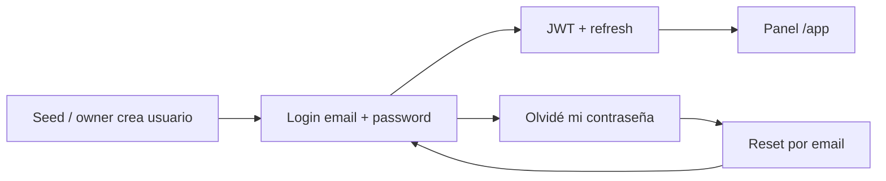
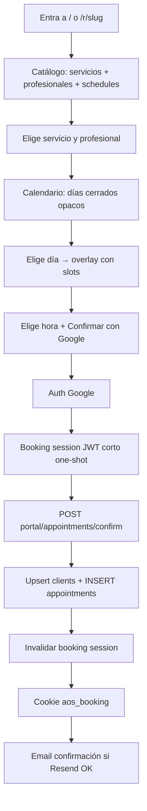

# Flujos de autenticación y reserva

## Quién es quién

| Actor | Auth | Panel | Cómo nace |
|-------|------|-------|-----------|
| **Interno** (`super_admin`, `admin`, …) | Email + password + recuperar contraseña | Sí (`/app`) | Seed / otro interno. **No hay auto-registro** |
| **Cliente** (quien agenda) | Google OAuth → **booking session** one-shot | No | **No** es fila en `users`. Upsert en `clients` + cita; sesión Google se **invalida** al confirmar |

Lo que ve **cualquier visitante** en la página pública: calendario y **horas disponibles**.  
**No** se publica quién agendó ni datos de otros clientes.

### Roles internos (seed)

| Rol | Puede | No puede |
|-----|--------|----------|
| `super_admin` | Todo, incluido `audit_logs` y gestión de users/roles/permissions | — |
| `admin` | Features (negocio, servicios, profesionales, citas, clientes, assets, availability) | Logs de auditoría; CRUD users/roles/permissions; `system:manage` |

---

## Flujo A — Usuario interno (panel)



Reglas:

- No existe “Crear cuenta” público para staff.
- Sí: login, logout, recuperar/cambiar contraseña.
- Permisos RBAC (`module:action`) como TPD.

---

## Flujo B — Cliente agenda hora (público)



### Disponibilidad

- Horarios semanales: tabla `professional_schedules` (0=dom … 6=sáb).
- Catálogo portal (`GET /portal/businesses/:slug/catalog`) incluye `schedules` por profesional.
- Slots: `POST /portal/appointments/slots` = horarios − excepciones − citas − duración/buffers.
- UI: días sin schedule deshabilitados; slots solo en overlay tras elegir día.

### Staff configura horarios

```mermaid
flowchart LR
  A[/app/profesionales] --> B[Horarios semanales]
  A --> C[Excepciones: cerrado festivo]
  B --> D[POST set-schedules]
  C --> E[POST exceptions/create]
  D --> F[Público: días semanales]
  E --> G[Público: día gris en calendario]
```

- `POST /internal/professionals/schedules/listar` `{ professionalId }`
- `POST /internal/professionals/set-schedules` `{ professionalId, schedules[] }`
- `POST /internal/professionals/exceptions/listar|create|eliminar`
- Catálogo portal incluye `exceptions[]` (`exceptionDate`, `isClosed`, `professionalId` null = todo el local)

### Staff agenda / gestiona citas

```mermaid
flowchart LR
  A[/app/citas] --> B[Filtros + pageSize]
  A --> C[Nueva cita]
  C --> D[slots portal]
  C --> E[POST appointments/create]
  B --> F[POST appointments/listar]
  A --> G[change-status / cancel]
  H[/app inicio] --> I[Gráfico citas por día]
```

- Alta interna: servicio + profesional + cliente (existente o nuevo) + slot libre
- Filtros: estado, servicio, profesional, cliente, rango de fechas
- Paginación: 10 / 20 / 30

- La booking session vive en Redis (jti) con TTL corto (~15 min) y **un solo uso**.
- Tras confirmar, queda inválida hasta un nuevo login Google.
- Upsert de `clients` es tolerante a carrera (email / google_sub únicos por negocio).
- **Nunca** se crea `users` ni rol de panel para el cliente.

### Cookie del cliente (solo su vista)

Tras agendar, el navegador guarda algo como (nombre tentativo `aos_booking`):

| Dato | Para qué |
|------|----------|
| email | Identificar al volver |
| nombre | Mostrar saludo / resumen |
| appointment_id | Referencia |
| starts_at / ends_at | “Tu hora” |
| service_name / professional_name | Qué agendó |
| business_slug | De qué negocio |

Al volver a la página pública:

- Si hay cookie válida → mostrar **“Tu hora: …”** (solo la suya).
- El calendario compartido sigue mostrando solo disponibilidad (no nombres de otros).

Cancelar/reprogramar: link con `cancel_token` (email) y/o flujo ligado a la cookie + Google si hace falta revalidar.

### Qué NO hace el cliente

- No tiene `/app` ni roles.
- No se registra como `users` interno.
- No ve citas ajenas.

---

## Privacidad en la página pública

| Visible para todos | Solo el cliente dueño | Solo internos (`/app`) |
|--------------------|----------------------|-------------------------|
| Slots libres / ocupados (sin nombres) | Resumen de **su** cita (cookie) | Todas las citas, clientes, historial |
| Servicios, profesionales, precios | Cancelar/reprogramar la suya | Audit, reportes, etc. |
