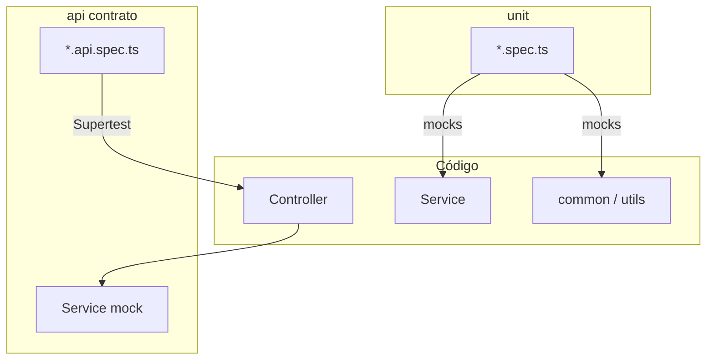

# Arquitectura de tests (backend)

Patrón alineado a **Team Prime Digital**: tests **solo backend**, con **CI en GitHub Actions**.

En CI (y en el día a día del PR) corren:

1. **Unitarios** — sobre lógica compartida (`common/` / shared) y lógica aislada de features.
2. **API (contrato)** — un test por endpoint / flujo HTTP crítico: **sin BD**, service mockeado. Validan que no se rompan contratos (status, body, DTO, errores) y flujos correctos a nivel HTTP.

Los tests de integración **con Postgres** (opcional, estilo TPD `tests/integration/`) pueden existir después; **no** son el foco del CI inicial.

---

## Dónde viven

### Features

```
backend/src/<feature>/
└── tests/
    ├── unit/              ← service / helpers con mocks
    └── api/               ← contrato HTTP (controller real + service mock)
        └── <feature>.contract.api.spec.ts
```

### Shared / common

Specs **colocalizados** junto al util (como TPD):

```
backend/src/common/
├── utils/
│   ├── foo.util.ts
│   └── foo.util.spec.ts      ← unit
├── pipes/
└── …
```

---

## Qué prueba cada capa

| Capa | ¿BD? | Qué valida | Cómo |
|------|------|------------|------|
| **Unit** | No | Funciones shared, parsers, reglas del service con mocks | Import directo + mocks |
| **API contrato** | **No** | Contrato HTTP: status, shape del JSON, validación DTO, excepciones de dominio mapeadas | Controller real + **service mock** + ValidationPipe + filter + Supertest |
| **Integration** (después) | Sí | Flujo real con Postgres | Módulo real + migrate/seeds |

### API contrato (lo importante)

Igual que en TPD (`*.contract.api.spec.ts`, `auth.login.api.spec.ts`, etc.):

- Monta `TestingModule` mínimo: controllers + `{ provide: XxxService, useValue: mock }`.
- Supertest pega al endpoint.
- Assert: `400` si el body es inválido, `404` si el service lanza la excepción de dominio, `200` + forma del body en happy path.
- El mock decide qué “haría” el service; **no** hay `DATABASE_URL` ni migraciones.

Es un “test de integración HTTP” **sin** BD: protege contratos y flujos correctos del controller/DTO/filter.

Helper recomendado (como TPD `common/testing/create-api-test-app`): app de test con pipes/filters iguales a producción.

---

## Pirámide

```text
        ┌─────────────────────┐
        │  integration (BD)   │  Opcional / más adelante
        └──────────┬──────────┘
        ┌──────────▼──────────┐
        │  api / contrato     │  Cada endpoint crítico — CI
        │  (sin BD)           │
        └──────────┬──────────┘
        ┌──────────▼──────────┐
        │  unit + shared      │  Utils common + lógica — CI
        └─────────────────────┘
```



---

## CI/CD — GitHub Actions

Workflow: `.github/workflows/backend-tests.yml`.

| Trigger | Acción |
|---------|--------|
| **`push` a `main`** | Corre tests backend (unit + API contrato) |

**No** se lanza en otras ramas ni por `pull_request`. Solo cuando hay push a `main`.

Pasos del workflow:

1. Checkout  
2. Setup Node (misma major que Docker, p. ej. 22) + pnpm  
3. `pnpm install --frozen-lockfile` en `backend/`  
4. **`pnpm test`** → unitarios (shared + features) **+** API contrato (sin BD)

Más adelante (como TPD), si se agregan integration con BD, se añaden pasos de Postgres + migrate en el mismo workflow.

---

## Lanzar tests a mano (Docker)

Con el stack arriba (`docker compose up`):

```bash
# Todo lo que corre en CI (unit + API contrato)
docker compose exec api pnpm test

# Solo unitarios / shared
docker compose exec api pnpm run test:unit

# Solo contratos API
docker compose exec api pnpm run test:api

# Watch (mientras desarrollas)
docker compose exec api pnpm run test:watch
```

Atajo desde la raíz del repo (script):

```bash
./scripts/test-backend.sh          # = pnpm test
./scripts/test-backend.sh unit     # = test:unit
./scripts/test-backend.sh api      # = test:api
./scripts/test-backend.sh watch    # = test:watch
```

`pnpm test` / CI deben **ignorar** `tests/integration/` para no exigir BD.

---

## Checklist — feature nueva

1. `tests/unit/` para lógica no trivial del service / helpers.  
2. `tests/api/` con contrato de **cada** endpoint relevante (happy + 400 validación + error de dominio).  
3. Utils en `common/` → `*.spec.ts` al lado.  
4. No romper el shape JSON / status que el front ya consume.  
5. El push a `main` no debe dejar tests rojos (workflow GitHub).  
6. **Actualizar docs** (`docs/architecture/*`, `features.md`, flujos) cuando cambie un contrato o UX de flujo.

### Endpoints recientes a cubrir en API contrato

| Feature | Endpoint | Spec |
|---------|----------|------|
| Professionals | `POST …/schedules/listar` | `professionals.api.spec.ts` |
| Professionals | `POST …/set-schedules` | idem |
| Businesses portal | `GET …/catalog` (+ `schedules`) | `businesses.api.spec.ts` |
| Businesses | `PATCH …/update` (`bookingEnabled`, QR texts) | idem |

---

## Referencias TPD

| Idea | En Team Prime |
|------|----------------|
| Estructura unit / api / integration | `docs/ARQUITECTURA-TESTS.md` |
| Contrato sin BD | `backend/src/**/tests/api/*.api.spec.ts` |
| Helper de app | `backend/src/common/testing/create-api-test-app` |
| Workflow | `.github/workflows/backend-tests.yml` |
