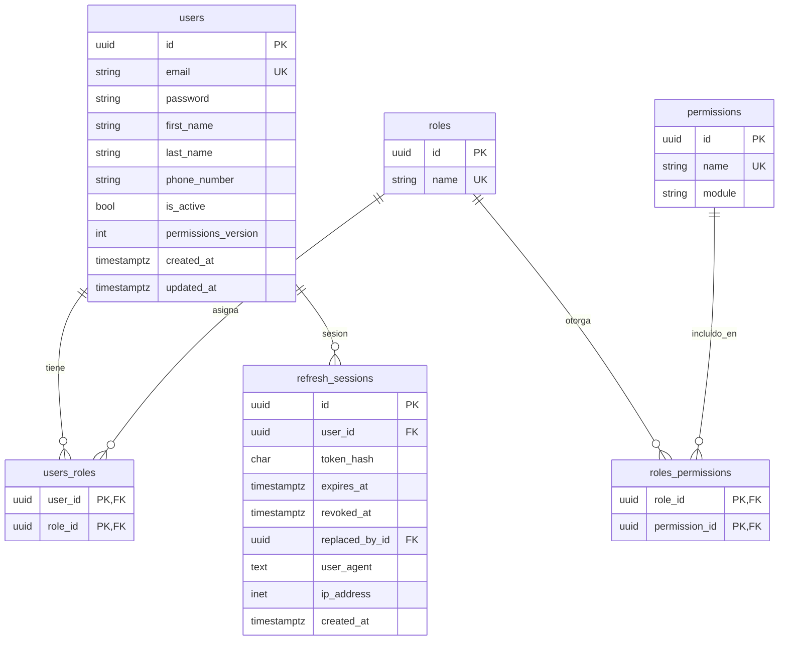
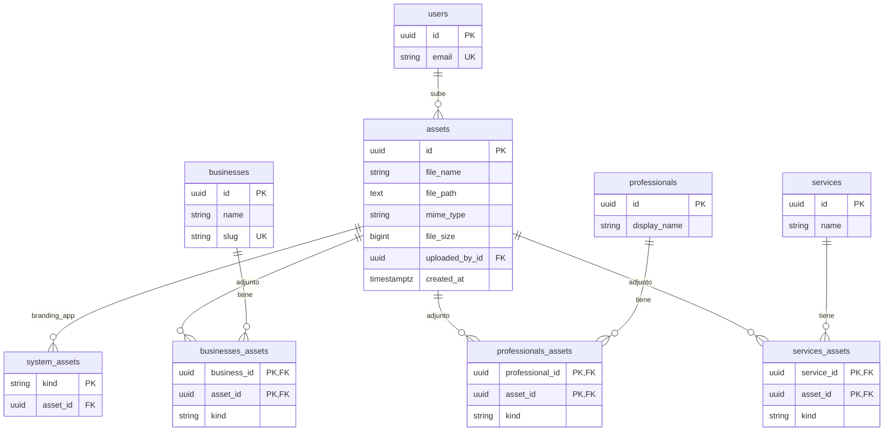
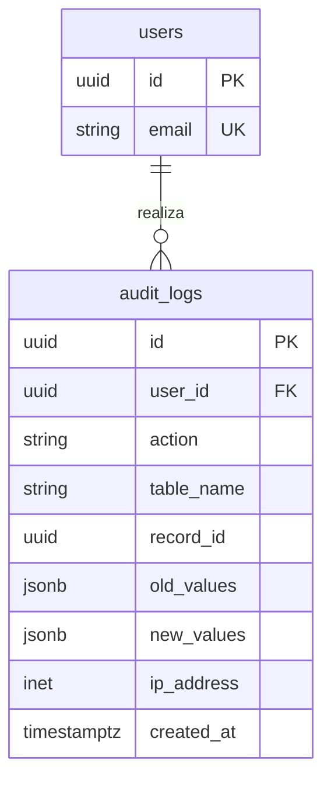
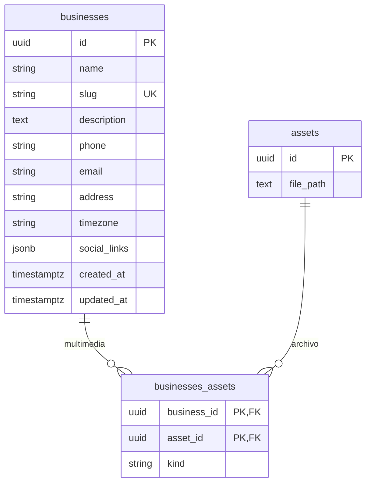
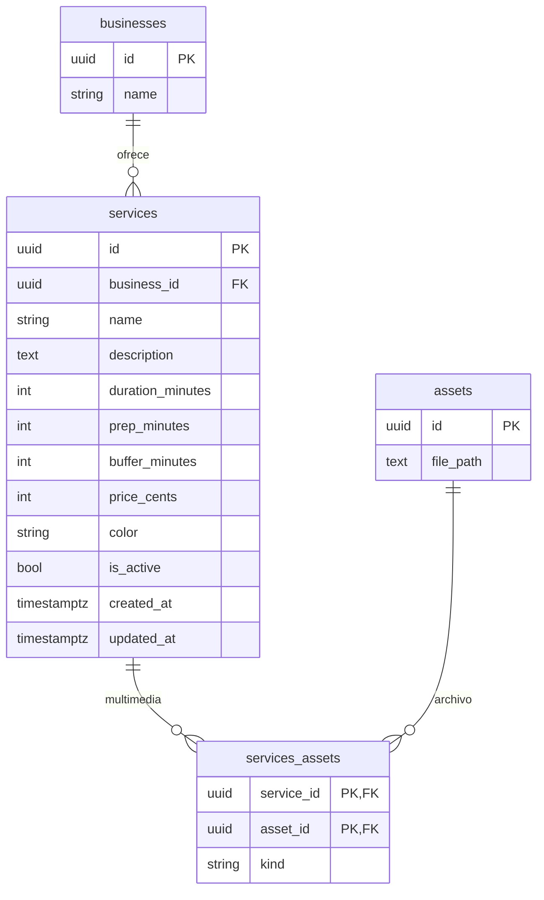
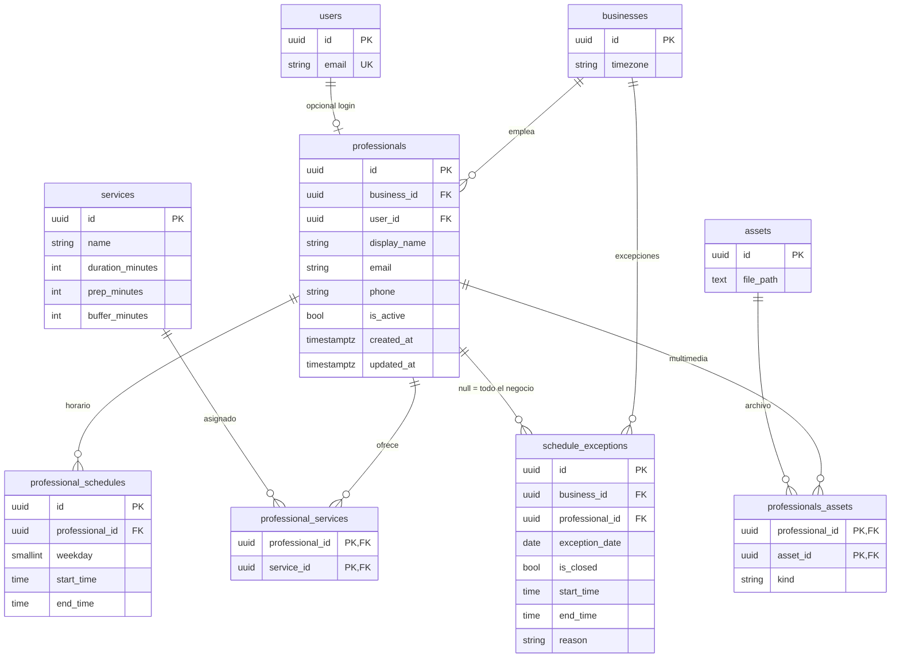
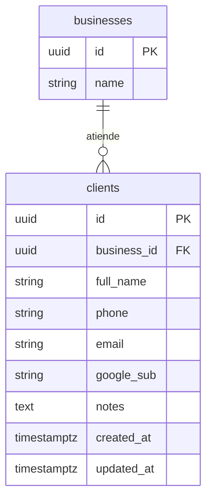
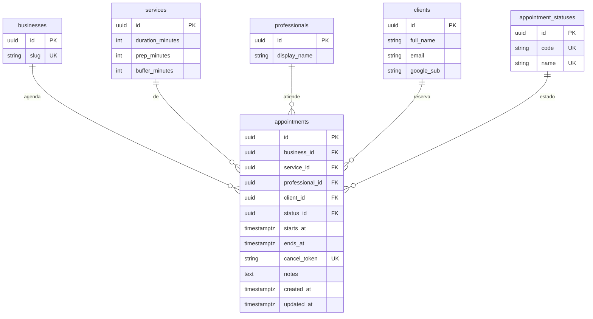
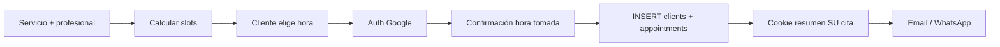

# MER — agenda-online-simple (V1)

Modelo entidad-relación por **features**. Auth/RBAC, **assets (R2)** y **audit_logs** al estilo **Team Prime Digital**.

- **Internos** (`users`): email + password + recuperar contraseña. **Sin auto-registro** (los crea el owner/seed).
- **Clientes**: no son `users`. Al agendar usan **Google OAuth**; quedan en `clients` + `appointments`. Resumen de **su** cita en **cookies** del navegador.
- Página pública: calendario = disponibilidad; no se muestran datos de otros clientes.
- Multimedia: `assets` + R2 + intermedias con `kind`.
- Auditoría: `audit_logs` (`table_name` + `record_id` + `ip_address`).

Flujos: [`architecture/flujos.md`](architecture/flujos.md). Enlace BD: [`architecture/bd.md`](architecture/bd.md).

> Mermaid `erDiagram` no soporta “cajas” por feature; por eso hay un **mapa**, un **overview con contenedores**, y luego un **MER por feature**.

---

## Mapa de features → tablas

| # | Feature | Tablas |
|---|---------|--------|
| 1 | **Auth / RBAC** | `users`, `roles`, `permissions`, `users_roles`, `roles_permissions`, `refresh_sessions` |
| 2 | **Assets (multimedia)** | `assets`, `system_assets`, `businesses_assets`, `professionals_assets`, `services_assets` |
| 3 | **Audit** | `audit_logs` |
| 4 | **Businesses** | `businesses` (+ puente assets) |
| 5 | **Services** | `services` (+ puente assets) |
| 6 | **Professionals + disponibilidad** | `professionals`, `professional_services`, `professional_schedules`, `schedule_exceptions` (+ puente assets) |
| 7 | **Clients** | `clients` |
| 8 | **Appointments (agendación)** | `appointments`, `appointment_statuses` |

Los **slots** no son tabla: se calculan (horarios − excepciones − citas − duración/buffers).

---

## Overview (contenedores)

```mermaid
flowchart TB
  subgraph F1["1 · Auth / RBAC"]
    users
    roles
    permissions
    users_roles
    roles_permissions
    refresh_sessions
  end

  subgraph F2["2 · Assets · R2"]
    assets
    system_assets
    businesses_assets
    professionals_assets
    services_assets
  end

  subgraph F3["3 · Audit"]
    audit_logs
  end

  subgraph F4["4 · Businesses"]
    businesses
  end

  subgraph F5["5 · Services"]
    services
  end

  subgraph F6["6 · Professionals + disponibilidad"]
    professionals
    professional_services
    professional_schedules
    schedule_exceptions
  end

  subgraph F7["7 · Clients"]
    clients
  end

  subgraph F8["8 · Appointments"]
    appointments
    appointment_statuses
  end

  users --> refresh_sessions
  users --> users_roles
  roles --> users_roles
  roles --> roles_permissions
  permissions --> roles_permissions
  users -.-> assets
  users -.-> audit_logs
  users -.-> professionals
  assets --> system_assets
  assets --> businesses_assets
  assets --> professionals_assets
  assets --> services_assets
  businesses --> businesses_assets
  businesses --> services
  businesses --> professionals
  businesses --> clients
  businesses --> appointments
  businesses --> schedule_exceptions
  professionals --> professional_services
  services --> professional_services
  professionals --> professional_schedules
  professionals --> appointments
  services --> appointments
  clients --> appointments
  appointment_statuses --> appointments
  professionals --> professionals_assets
  services --> services_assets
```

---

## 1 · Auth / RBAC

**Solo usuarios internos.** Login email + password + reset. Permisos `module:action` como TPD. Google OAuth **no** crea filas aquí.

| Rol | Alcance |
|-----|---------|
| `super_admin` | Todo: features + users/roles/permissions + `audit_logs` + `system:manage` |
| `admin` | Features de negocio; **sin** audit logs ni gestión de users/roles/permissions |
| `professional` | (después) Su agenda y citas |
| `receptionist` | (después) Citas y clientes |

Permisos V1: `users`, `roles`, `permissions`, `businesses`, `services`, `professionals`, `availability`, `appointments`, `clients`, `assets`, `audit_logs`, `system` (`module:action`).

---

## 2 · Assets (multimedia + R2)

Metadata en Postgres; binario en **R2 privado**. Logos **subidos**, no en el repo.

| Tabla | `kind` típicos |
|-------|----------------|
| `system_assets` | `logo`, `favicon` (instalación del producto) |
| `businesses_assets` | `logo`, `cover`, `gallery` |
| `professionals_assets` | `avatar`, `gallery` |
| `services_assets` | `image`, `gallery` |

`file_path` = object key R2. Env: `R2_ENDPOINT_URL`, `R2_ACCESS_KEY_ID`, `R2_SECRET_ACCESS_KEY`, `R2_BUCKET_SYSTEM`.

---

## 3 · Audit

Genérico: cualquier tabla se audita sin cambiar su esquema.

| Campo | Rol |
|-------|-----|
| `user_id` | Quién (nullable si sistema) |
| `action` | `create` / `update` / `delete` (y las que se definan) |
| `table_name` | Ej. `appointments`, `services` |
| `record_id` | UUID del registro afectado |
| `old_values` / `new_values` | JSONB |
| `ip_address` | IP del cliente (`INET`); desde request / proxy (`X-Forwarded-For` si Traefik) |

`action`: `create` / `update` / `delete` (y las que se definan). Índices: `user_id`, `table_name`, `created_at`, `ip_address`.

---

## 4 · Businesses

Logo de la página pública: `businesses_assets` con `kind=logo` (no FK `logo_asset_id`).

---

## 5 · Services

---

## 6 · Professionals + disponibilidad

Horarios semanales + excepciones. Motor de slots usa esto en runtime (no hay tabla `slots`).

---

## 7 · Clients

Ficha del cliente que agenda. **No** es usuario del panel. Se crea/actualiza al confirmar con Google (email/nombre del perfil).

- `google_sub` / `email`: identidad Google al agendar (opcional phone si lo pide el flujo).
- Unicidad sugerida: `(business_id, email)` o `(business_id, google_sub)`.
- La **cookie** del navegador no es tabla: guarda el resumen de “su” cita para la UI pública (ver [`architecture/flujos.md`](architecture/flujos.md)).

---

## 8 · Appointments (agendación)

La cita concreta. Registro completo en BD (solo internos lo ven completo). El cliente ve **la suya** vía cookie + email/`cancel_token`.

Estados: `pending`, `confirmed`, `attended`, `cancelled`, `no_show`.

**Flujo de reserva (lógico):**

Slots = `professional_schedules` − `schedule_exceptions` − citas activas − duración/buffers del `service`.

Público ve solo slots libres/ocupados (anónimo). Internos ven quién reservó.

---

## Fuera de V1 (después)

Packs, recurrentes, depósitos, sucursales, sync calendarios… Si llevan archivos: nueva puente `*_assets` + `kind`.

---

## Notas transversales

- Dinero en `price_cents`.
- Horarios con `businesses.timezone`.
- Concurrencia: lógica en service + posible exclusion constraint en citas activas.
- Credenciales solo en `.env` (`DATABASE_URL`, `R2_*`, `GOOGLE_*`, `JWT_*`).
